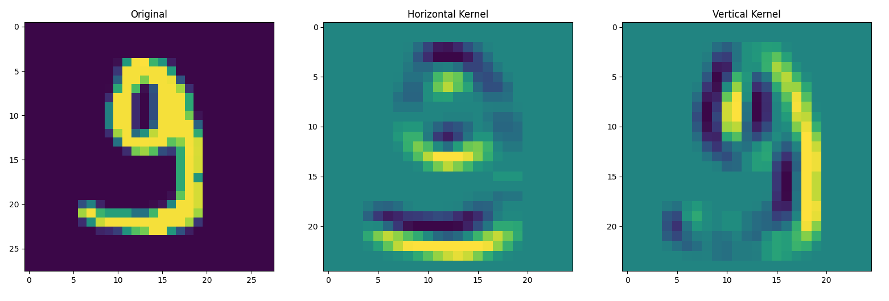

# Introduction

## Filters

Convolution filters apply structured weights across an image.

To apply a filter $K$ to an image $I$, compute $C$ where
$$
C_{j, k} = \sum_l \sum_m I_{j+l,k+m} K_{l,m}
$$

Example filtering $28\times28$ image with two $3\times3$ filters

$$
H =
\begin{bmatrix}
 1 & 1 & 1 \\
 0 & 0 & 0 \\
 -1 & -1 & -1
\end{bmatrix}, \
V = 
\begin{bmatrix}
 1 & 0 & -1 \\
 1 & 0 & -1 \\
 1 & 0 & -1
\end{bmatrix}
$$



# Code

## Layers

The network is a composition of sequential layers. Each layer takes input, performs an operations, and passes output to the next.

### Convolution

Application of filters. The filters are a $C_{in} \times C_{out} \times M \times M$ matrix.

- input: $C_{in} \times H \times W$
- output: $C_{out} \times \lfloor \frac{H + 2P - M}{S} + 1 \rfloor \times \lfloor \frac{W + 2P - M}{S} + 1 \rfloor$

### Pooling

Convolution where the filter is a reduction operation like maximum or average.

### Activation

Non-linear function applied element-wise

- $\text{ReLU}(x) = \max(0, x)$
- $\text{Softmax}(x) = \frac{e^x}{\sum e^x}$

### Dense

Input is flattened, multiplied by a matrix, and added to a bias term. 

## Cnn

```python
Layers = 
        Convolution(kernel_height=5, 
                    kernel_width=5, 
                    channels_in=1, 
                    channels_out=32)
        ReLU()
        MaxPooling(filter_size=2, stride=2)
        Convolution(kernel_height=5, 
                    kernel_width=5, 
                    channels_in=32, 
                    channels_out=64),
        ReLU()
        MaxPooling(filter_size=2, stride=2)
        Dense(channels_in=1024, channels_out=1024)
        ReLU()
        Dense(channels_in=1024, channels_out=10)
        Softmax()
```

# Training and Evaluation

# Tests

# Visualization